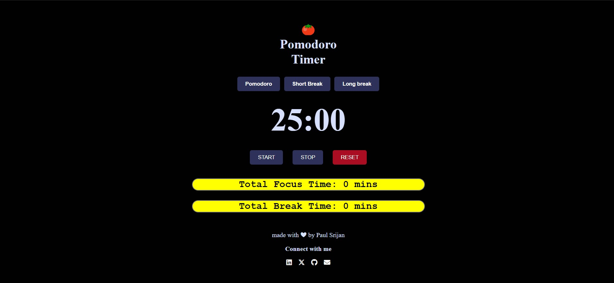

```markdown
# 🍅 Pomodoro Timer


A simple yet effective **Pomodoro Timer** built with HTML, CSS, and JavaScript to help you stay productive using the popular Pomodoro Technique. Choose between a **Pomodoro session**, **short break**, or **long break** to manage your work sessions effectively. Track your total focus and break time with real-time updates.

## Features

- **Three Timers**: Pomodoro (25 minutes), Short Break (5 minutes), and Long Break (10 minutes)
- **Start, Stop, and Reset Controls**: Easily control each timer
- **Total Focus and Break Time Tracking**: Tracks the total time spent on work and breaks for better productivity analysis
- **Customizable Alerts**: An alert sound plays when each session ends

## Preview



## How It Works

1. **Select Timer**: Choose a Pomodoro session, short break, or long break.
2. **Start Timer**: Press `START` to begin the timer countdown.
3. **Pause or Reset**: Use the `STOP` button to pause, or the `RESET` button to start over.
4. **Track Total Time**: Total focus and break times are updated after each session.

<!-- ## Project Structure

```plaintext
.
├── index.html    # HTML structure for the Pomodoro Timer
├── style.css     # Styling for the timer and controls
└── script.js     # JavaScript for timer functionality and tracking
``` -->

## Getting Started

To run this project on your local machine:

1. **Clone the repository**:
   ```bash
   git clone https://github.com/yourusername/pomodoro-timer.git
   ```
2. **Open the project folder**:
   ```bash
   cd pomodoro-timer
   ```
3. **Run the project**:
   - Open `index.html` in your browser.

## Code Overview

### HTML
The HTML file contains the basic structure of the Pomodoro Timer, including:
- Timer display
- Control buttons (Start, Stop, Reset)
- Selection buttons (Pomodoro, Short Break, Long Break)
- Total time tracking for focus and break sessions

### CSS
The CSS file defines a dark-themed, minimalist design with responsive styling for better usability.

### JavaScript
The JavaScript file handles:
- Timer selection and display logic
- Countdown functionality for each timer type
- Start, stop, and reset controls
- Sound alert at the end of each session
- Tracking of total focus and break times

## Technologies Used

- **HTML5** for the structure
- **CSS3** for styling and layout
- **JavaScript** (ES6) for functionality

## Future Enhancements

- **Custom Timer Durations**: Add the ability to set custom durations for each session.
- **UI Improvements**: Include themes and animations to enhance user experience.
- **Save Progress**: Persist total focus and break time across sessions using local storage.


## Author

**Srijan Paul**  
[GitHub Profile](https://github.com/paul-srijan)

---

## Connect with Me

Feel free to connect with me on my other platforms for updates, queries, or collaborations!


- **GitHub**: [paul-srijan](https://github.com/paul-srijan)
- **LinkedIn**: [Srijan Paul](https://www.linkedin.com/in/srijan-paul-547354260/)
- **Email**: iampaulsrijan@gmail.com
- **twitter**: [Paul Srijan](https://x.com/iampaulsrijan)

---

---

Happy Productivity! 🍅
```
